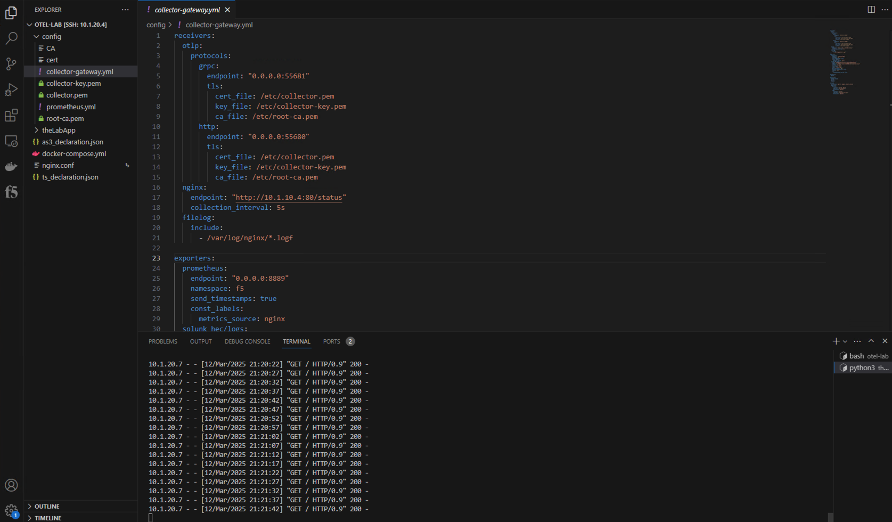
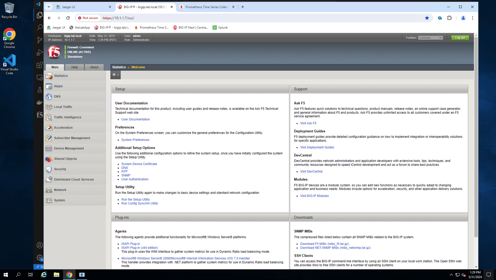
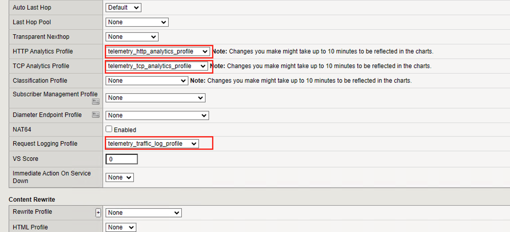
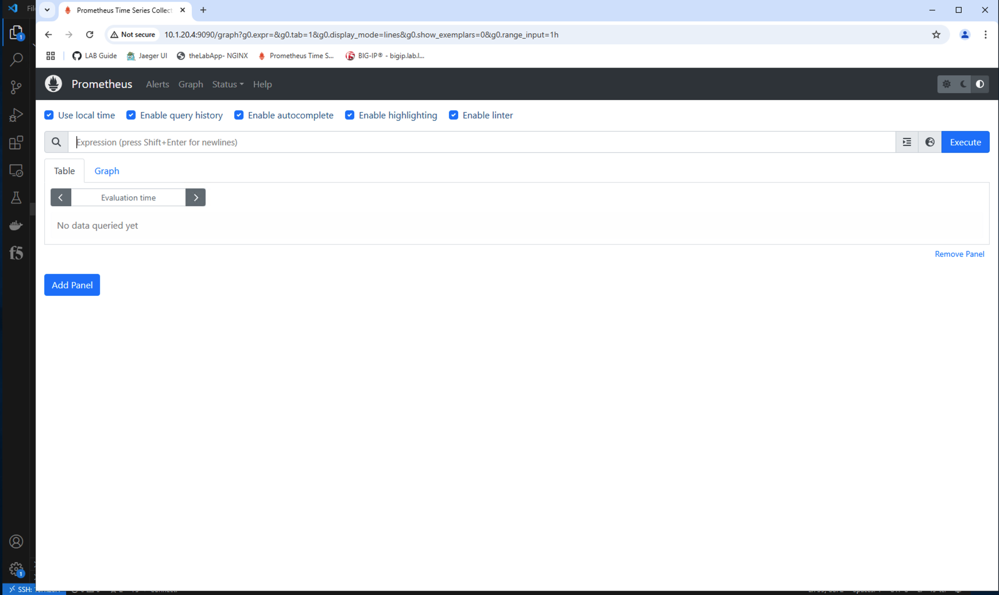
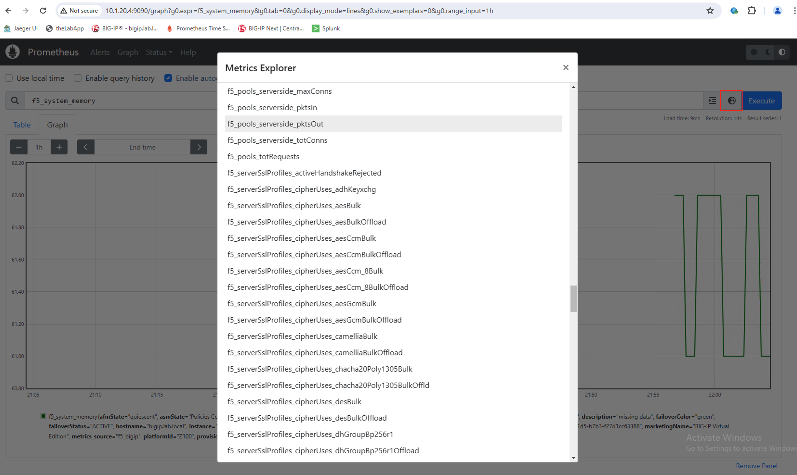

Exercise 3 - Exporting BIG-IP metrics using the OTel consumer
============================================================================

During this exercise, you will configure a BIG-IP virtual edition, (using AS3 and Telemetry Streaming) to send metrics to a locally installed Prometheus instance by way of an OpenTelemetry collector.

The OpenTelemetry Collector service provides a vendor-agnostic proxy to receive, process and export observability data.  The collector supports open-source observability data formats (e.g. Jaeger, Prometheus, Fluent Bit, etc.) sending to one or more open-source or commercial back-ends.

The OTel collector is managed via a user-readable YAML configuration file.  At a minimum, the configuration must include the following three sections:
- **Receivers** - section with information related to how the collector will receive observability data, (i.e. protocols, endpoint addresses, ports) 

- **Processors** - section with configuration information related to data manipulation and insertion.  In this section, one can add/delete/modify data streams using filters.

- **Exporters** - section including information related push or pull based backends/destinations

Review OTel Collector configuration
^^^^^^^^^^^^^^^^^^^^^^^^^^^^^^^^^^^^

From the VS Code UI use the navigation pane on the left and open the OTel collector gateway configuration file, (*collector-gateway.yml*).  Familiarize yourself with the configuration file contents.  

For this specific exercise, the collector configuration file, (*example below*)  has been configured to:
 - Receive telemetry via OTLP over either HTTP or gRPC
 - Process records using the standard batch processor
 - Export metrics to a Prometheus backend

Once you have familiarized yourself with the OTel collector configuration, use Google Chrome to navigate to the lab BIG-IP UI.  Login using the credentials available on the UDF details tab and review the current BIG-IP configuration.

Configure the BIG-IP for telemetry streaming
^^^^^^^^^^^^^^^^^^^^^^^^^^^^^^^^^^^^^^^^^^^^^

You will now configure the lab BIG-IP with the necessary resources to send metrics to the OTel collector receiver endpoint.  This can be easily accomplished by applying Applications Services 3 extension (AS3) and Telemetry Streaming (TS) declarations.  You will apply the declarations using curl commands from the VSCode editor.

AS3 declaration
+++++++++++++++

The F5 BIG-IP Application Services 3 Extension (referred to as BIG-IP AS3) is a flexible, low-overhead mechanism for managing application-specific configurations on a BIG-IP system. BIG-IP AS3 uses a declarative model, meaning you provide a JSON declaration rather than a set of imperative commands.  Review the provided AS3 declaration. The declaration will deploy remote logging resources, (publishers, virtual, profiles, etc.) required for remote logging capture and transmission. From the VS Code UI open a new terminal tab and use the following curl command to post the declaration.

``curl -u admin:F5labnet! -k -X POST "https://10.1.1.7/mgmt/shared/appsvcs/declare" -H "Content-Type:application/json" -d @/home/xuser/otel-lab/as3_declaration.json``

.. image:: ../images/Picture20.png

TS declaration
++++++++++++++++++++++

F5 BIG-IP Telemetry Streaming (BIG-IP TS) enables you to declaratively aggregate, normalize, and forward statistics and events from the BIG-IP to a consumer application.  To use BIG-IP TS, you POST a single JSON declaration to BIG-IP TS’s declarative REST API endpoint.  Review the provided TS declaration.  The declaration configures the telemetry streaming service to push events to an OTel collector.  The OTel collector consumer is limited to delivering metrics.  The consumer is configured to use the OTLP protocol over gRPC with the port of 55681.  POST the provided declaration with the below command.

``curl -u admin:F5labnet! -k -X POST "https://10.1.1.7/mgmt/shared/telemetry/declare" -H "Content-Type:application/json" -d @/home/xuser/otel-lab/ts_declaration.json``

.. image:: ../images/Picture21.png

Associate logging profiles with BIG-IP virutual server
^^^^^^^^^^^^^^^^^^^^^^^^^^^^^^^^^^^^^^^^^^^^^^^^^^^^^^^

Wth the TS declaration posted, the BIG-IP will start to push basic system info metrics to the OTel collector.  Additionally, you will enable AVR and LTM request logging system info is configured.  To do so, you will associate the relevant AS3 logging profiles with the application's virtual server configuration.  

From the BIG-IP UI, select and open the '*theLabApp_vs*'.  Scroll down and switch the configuration option to *Advanced*, (see below).

.. image:: ../images/Picture37.png

With the advanced configuration visible, scroll down and select the appropriate **HTTP Analytics**, **TCP Analytics**, and **Request Logging** profiles, (see below).  Select '*Update*' to save the configuration changes.

Verify data delivery
^^^^^^^^^^^^^^^^^^^^^

The BIG-IP is now configured to send telemetry.  If not currently opened, open Google Chrome from the desktop and select the Prometheus tab.  If the tab is no longer visible, the Prometheus UI is located at http://10.1.20.4:9090.

To perform a quick test on the system, select the *Graph* tab and enter '**f5_system_memory**' in the search bar; click on 'Execute'.  

The system will query metrics for the BIG-IP system memory metric and return a relevant time chart, (*see below*).

**Note:** *It may take SEVERAL MINUTES for the metrics to begin appearing in Prometheus.*

.. image:: ../images/Picture25.png

You can use the metrics explorer to view the available BIG-IP metrics (*see below*).

This concludes Exercise 3.

---

Go to `Overview <../overview.html>`_
