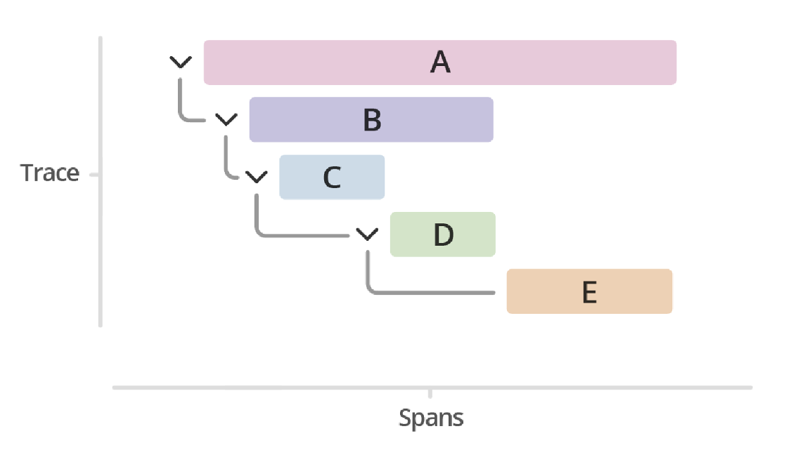
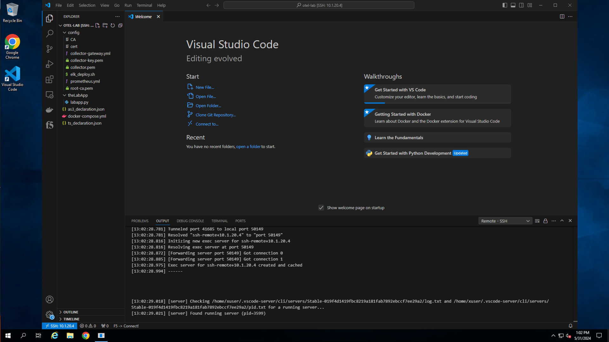
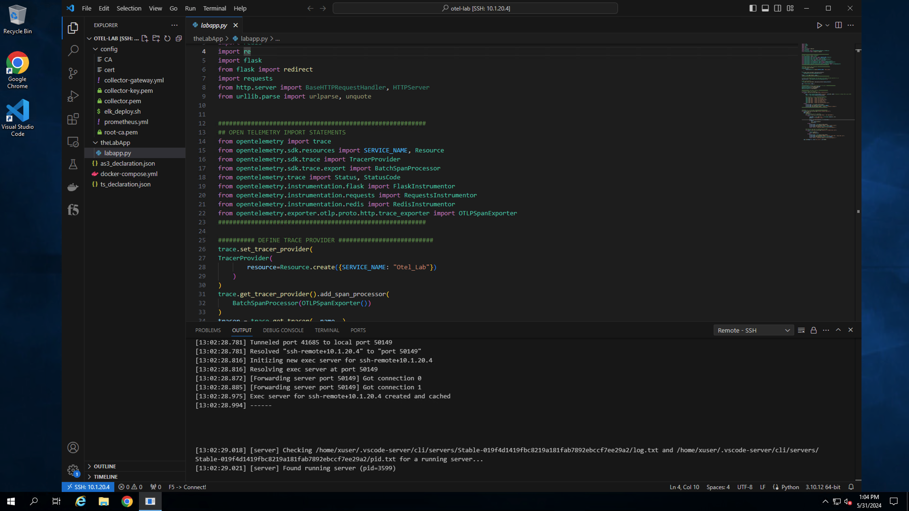
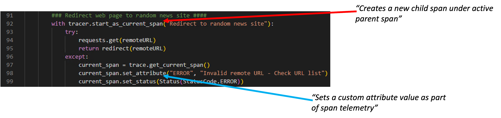
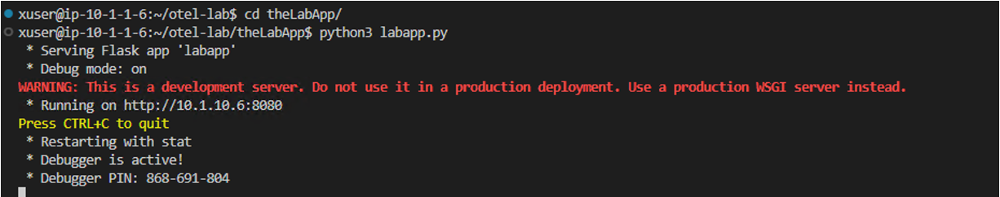
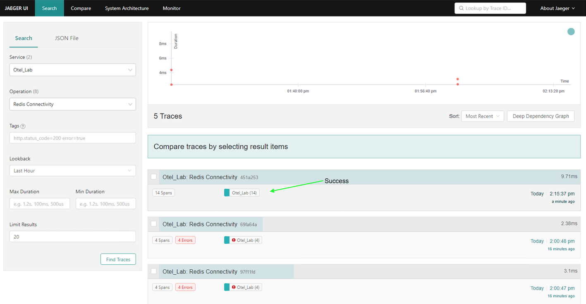
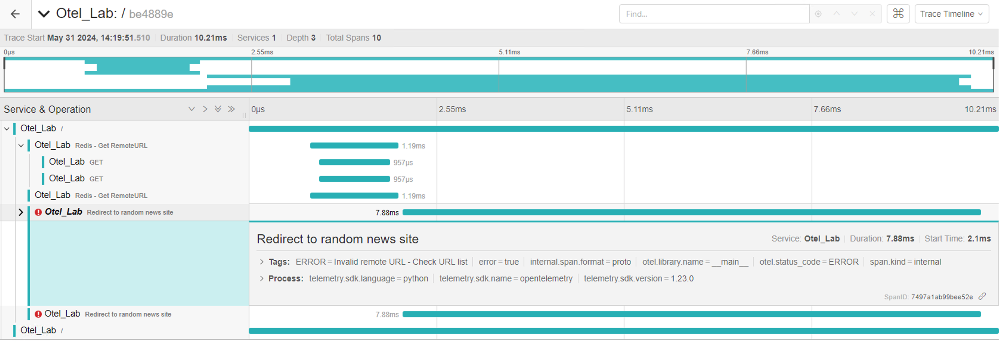

App instrumentation walk-through and troubleshooting
====================================================

Deploy blueprint and connect to jumpbox
---------------------------------------

From the `UDF <https://udf.f5.com/blueprints>`_ console, search for and deploy the blueprint entitled *AW26-Talking telemetry and observability with F5*. 
Once the blueprint has finished deploying, access the Windows jump box by selecting the RDP access link, (*see below*).  The jump box will be used to complete all lab exercises.  Credentials for this lab can be viewed by accessing the system(s) **DETAILS** tab.

.. image:: ../images/Picture1.png
   :width: 750px
   :alt: Image 1

Upon successful login to the jump box, you will arrive at the Windows server desktop, (see below).

.. image:: ../images/Picture2.png
   :width: 650px
   :alt: Image 2

Review sample application instrumentation
------------------------------------------

For a system to be observable, it must be instrumented. The code needs to emit traces, metrics, and/or logs.  To accomplish this, the `OpenTelemetry <https://opentelemetry.io>`_ project includes SDKs for a majority of modern programming languages.  For this exercise, a sample application, (***labapp.py***) has been instrumented, using the OpenTelemetry Python SDK, to send trace data to a locally running `Jaeger <https://www.jaegertracing.io>`_ instance.

Traces and Spans
^^^^^^^^^^^^^^^^^
A trace is a collection of operations that represents a unique transaction handled by an application and its services. A span represents a single operation within a trace.  

The image below (courtesy of `Splunk <https://help.splunk.com/en/splunk-observability-cloud/monitor-application-performance/manage-services-spans-and-traces-in-splunk-apm#what-are-traces-and-spans-0>`_) shows a trace represented by a series of multicolored bars labeled with the letters A, B, C, D, and E. Each lettered bar represents a single span. The spans are organized to visually represent a hierarchical relationship in which span A is the parent span and the subsequent spans are its children.

A span might refer to another span as its parent, indicating a relationship between operations involved in the trace. In the image above, span A is a parent span, and span B is a child span. 

This relationship could indicate that, for example, span A makes a service call that triggers the operation captured by span B. In this image, span C is also a child of span B, and so on.

Review the sample application
-----------------------------

**Note:** *Although a basic understanding of Python may be helpful, this lab assumes no previous coding experience*.

Navigate to and open Visual Studio (VS) Code from the Windows desktop, (see below).  You will be using VS Code to review and edit the application file.  VS Code will be prompt you for user credentials as it creates a remote session with the application server, (theWorks). Credentials are available in the *theWorks* **DETAILS** tab.

.. tip:: 
   Tip: If the login fails, wait 30 seconds and try again.

With VS Code open, use the navigation pane on the left and open the application file, (theLabApp/labapp.py).  When ran, the application will:

1. Create a local web site located at http://10.1.10.4
2. Connect to and populate a Redis database container with several key/value pairs
3. Randomly select and retrieve a URL record from the Redis DB
4. Redirect the site visitor to the selected URL

With the file open in the viewer, locate and review the various OTel relevant snippets.  

OTel SDK module import
^^^^^^^^^^^^^^^^^^^^^^

Import statements are used to reference and utilize previously created python modules.  The OpenTelemetry SDK includes several submodules which can be imported, (*see below*) depending upon the libraries utilized, services requiring instrumentation, and exporter(s) required.

This application has imports to handle automatic instrumenting of Flask and Request, (*web services*) as well as Redis.  In addition, there are import statements for processors and OTel exporters.

.. image:: ../images/Picture5.png
   :alt: Image 5
   :width: 600px

Trace provider
^^^^^^^^^^^^^^
The provider section, (*see below*) defines the source of traces that are generated by the application.  In this case, the provider service name has been set to '*Otel_Lab*'.  As the below image illustrates, traces sent to the visibility provider, (Jaeger) are categorized by the service name.

.. image:: ../images/Picture6.png
   :alt: Image 6

OTel exporters
^^^^^^^^^^^^^^
The sample application has been configured with a batch OTLP span exporter. Exporters define where the application should direct (*export*) observability data. Many observability providers have developed custom exporters allowing for direct ingestion of traces, metrics, and/or logs.  

.. image:: ../images/Picture7.png
   :alt: Image 7
   :width: 550px

Instrumentation
^^^^^^^^^^^^^^^
With the above OTel SDK sections defined in the code, the desired application libraries, calls and functions can be instrumented.  The OpenTelemetry SDK supports both automatic instrumentation as well as manual instrumentation.

Automatic instrumentation
+++++++++++++++++++++++++
Many Python modules support automatic instrumentation.  For example, the sample application code makes use of the Redis module/library to connect to and update a Redis database.  By simply including the snippet shown below, relevant tracing data is automatically generated for Redis interactions.

.. image:: ../images/Picture8.png
   :alt: Image 8
   :width: 650px

Manual instrumentation
++++++++++++++++++++++
You will add in manual instrumentation when either automatic instrumentation is not available  or if you have a desire to configure your own tracing spans.  In the code snippet below, a new span will be generated on line 92.  Additionally, metadata such as custom attributes and status codes can be generated.

The screenshot below illustrates how the above manually created instrumentation is generated and rendered in Jaeger.

.. image:: ../images/Picture10.png
   :alt: Image 10
   :width: 750px

------------

Troubleshooting - *"Sorry...something must be misconfigured"*
--------------------------------------------------------------
Now that you are equipped with a very limited understanding of how the sample application is instrumented for OpenTelemetry, you can start the application.

From the VS Code UI, switch to the terminal window via the lower tab bar.  From the terminal window start the application by entering the following commands:

``cd theLabApp``

``python3 labapp.py``

The application will start and the exposed endpoint will be presented as shown below.  Any additional code changes will trigger an automatic application restart.

   
To test the application, you can select and open the link provided in the terminal window as illustrated above or you can navigate to Google Chrome located on the desktop.  With Chrome opened, open a new tab and navigate to the application's endpoint, (published via NGINX Plus) -  http://10.1.10.4.

.. image:: ../images/Picture12.png
   :alt: Image 12

As you can see above, there is an issue(s) with the application.  If the application was running as intended, the browser session would have been automatically redirected to a random news site.  

For the remainder of this exercise, you will use Jaeger to identify and investigate any errors.  You will then update the application code to correct the identified errors.

Troubleshoot Redis connectivity
^^^^^^^^^^^^^^^^^^^^^^^^^^^^^^^

If not currently opened, open Google Chrome from the desktop and select the  Jaeger UI tab.  If the Jaeger tab is no longer visible, the console is located at http://10.1.20.4:16686.

Select the '*Otel_Lab*' service from the 'Service' drop-down, '*Redis Connectivity*' from the 'Operation' drop-down and click on 'Find Traces'.  If that is not an available option, refresh the web page and try again.  You should see output similar to the below example.  

You will likely note multiple errors.  To begin with, address the errors associated with the **Redis Connectivity** traces.  Review the trace/span entries in Jaeger along with the application file, (*labapp.py*) to identify the issue related to connecting to Redis.

.. image:: ../images/Picture13.png
   :alt: Image 13

Update the application file in VS Code to correct the issue and save your changes.  Upon saving, the application will automatically restart.  Test your application changes by navigating to the application endpoint at http://10.1.10.4.  

Once you have tried the application, (*yes, it will still fail*), return to the Jaeger UI and search for the latest traces by selecting **Find Traces**. If you have successfully corrected the issue you should see a similar output to the below example.  While there are still errors reporting, you should see a successful **Redis Connectivity** trace entry.

Troubleshoot application
^^^^^^^^^^^^^^^^^^^^^^^^

With the database connectivity issue resolved, you will note errors are still being recorded, (*see below*).

.. image:: ../images/Picture15.png
   :alt: Image 15

Review the trace/span entries to identify possible causes of the application issue.  Be sure to drill down, (*example below*) into spans to help identify the root cause(s).

As with the previous issue, update the application file in VS Code to correct the issue and save your changes.  Upon saving, the application will automatically restart.  Test your application changes by navigating to the application endpoint at http://10.1.10.4.

If your corrections are successful, the browser session should be redirected to a random news site.  To verify all issues have been addressed, review the latest trace information in Jaeger.  If all issues have been remediated, you should see results similar to the below example.

.. image:: ../images/Picture17.png
   :alt: Image 17

This concludes Exercise 1.  **Be sure to leave your application running for use in the next lab.**

---

Go to `Exercise 2 - Exporting NGINX Plus spans and metrics using Open Telemetry <../lab2/lab2.html>`_

Go to `Overview <../overview.html>`_