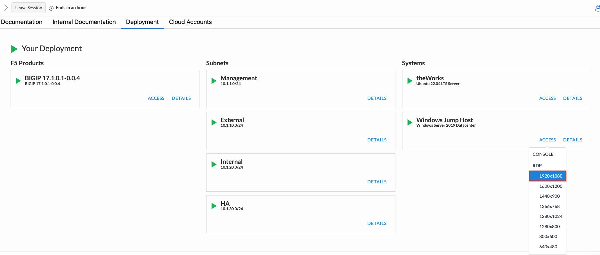

Introduction - “F5 BIG‑IP Troubleshooting Lab: LTM & ASM/AWAF Tickets”
====================================================

Audience: Intermediate F5 admins familiar with basic VS/pool/WAF concepts.
---------------------------------------
Objectives:

   Use BIG‑IP tools (GUI, tmsh, logs) to troubleshoot L4–L7 issues.

   Diagnose and fix misconfigurations in LTM and ASM/AWAF.

   Interpret WAF events (false positives vs real attacks).

Environment:

   Diagram: Client ↔ BIG‑IP ↔ Web servers, with WAF on one or more VIPs.

   Access info: mgmt IP/URL, credentials, jumphost info.

Deploy blueprint and connect to jumpbox
---------------------------------------

From the `UDF <https://udf.f5.com/blueprints>`_ console, search for and deploy the blueprint entitled *AppWorld 2026 - F5 Insight for ADSP*. 
Once the blueprint has finished deploying, access F5 Insight by selecting the GUI access link, (*see below*).  Credentials for this lab can be viewed by accessing the guest(s) **DOCUMENTATION** tab.

Upon successful login to F5 Insight, you will arrive at the home page, (see below).

.. image:: ../images/Picture2.png
   :width: 650px
   :alt: Image 2

How to use this lab
---------------------------------------

    Scenario: You are a Tier‑2 engineer receiving tickets from users or Tier‑1.

    Tools expected:

        tmsh, System › Logs › Local Traffic / Application, tcpdump/ssldump, curl from BIG‑IP, browser.

    Student deliverables per ticket:

        Root cause explanation.

        Exact fix proposed.

        Evidence (screenshot or command output).

This concludes Getting Started.  

---

Go to `Ticket 1 <../lab1/lab1.html>`_

Go to `Overview <../overview.html>`_